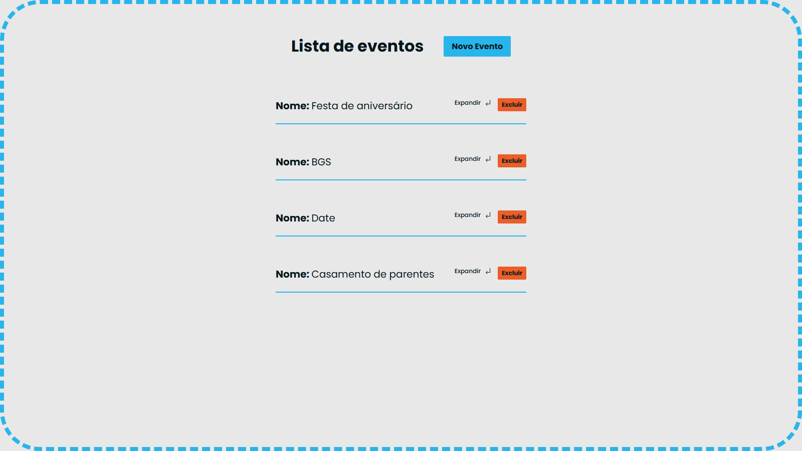
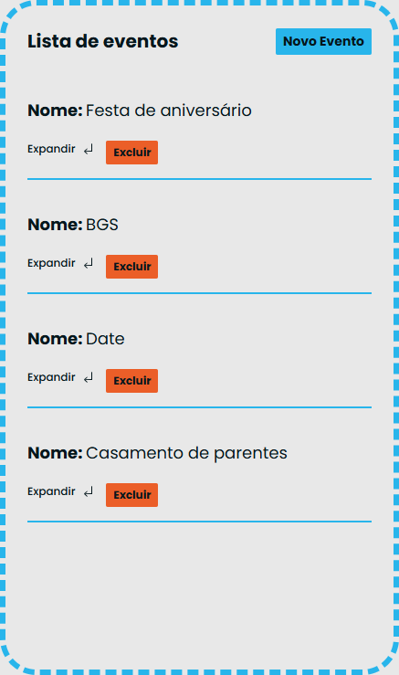

# EventsCreater

EventsCreater is an app made to organize your events schedule.
College assigment.

## Table of Contents
1. [Screenshots](#screenshots)
4. [Running Locally](#running-locally)

## Screenshots



#### Responsive Design



## Running Locally

Clone the project

```bash
  git clone https://link-to-the-project
```

Navigate to the project directory

```bash
  cd my-project
```

# Web Folder

Navigate to the frontend directory

```bash
  cd frontend
```

Install dependencies

```bash
  npm install
```

Start the vite server

```bash
  npm run dev
```

# Server Folder

XAMPP required.

The backend folder must be inside xampp/htdocs.
You must start Apache and MySQL to run the server.
